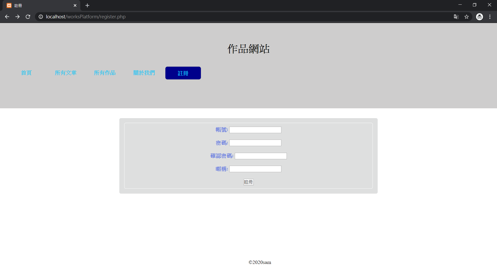
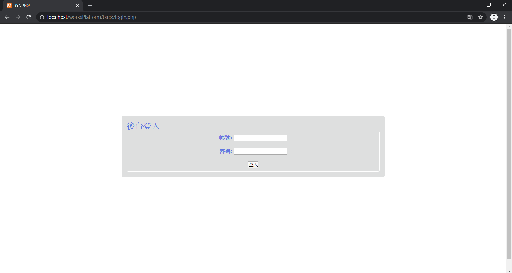
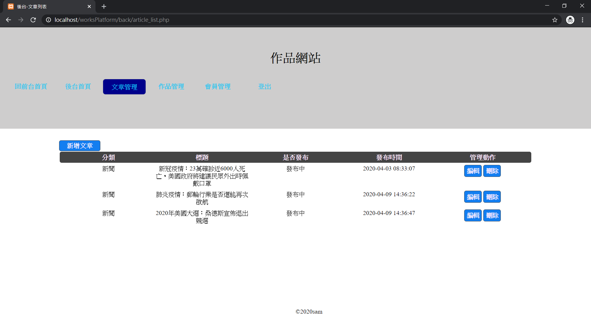
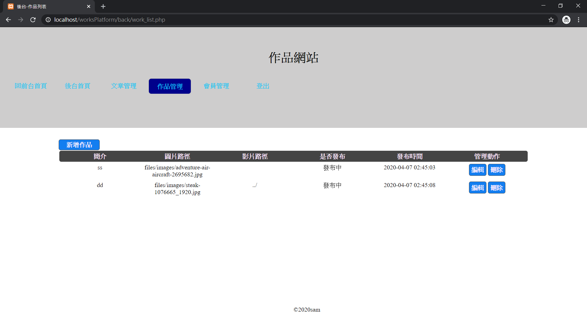
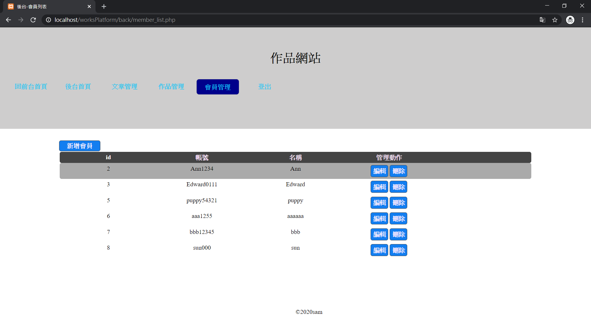

# worksPlatform

## 簡介:php與mysql實作有前後台功能之網站。

## 使用技術:
* 1.以phpmyadmin做資料庫介面操作。
* 2.透過php操作資料庫做crud。
* 3.送出表單時以ajax做串接。
* 4.將重複編寫到的內容整合成獨立的php檔，視需求以require/include引入使用

## functions:
* 1.使用者可於前台瀏覽所有發布之文章及基本網站介紹.註冊會員
* 2.登入後台後可以進行文章.會員的新增.編輯.刪除等管理

## 畫面預覽:

註冊

登入

文章管理

作品管理

會員管理

